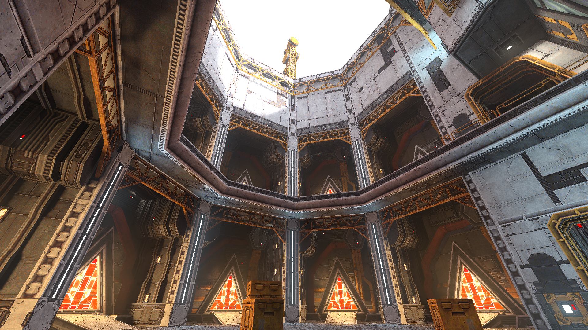
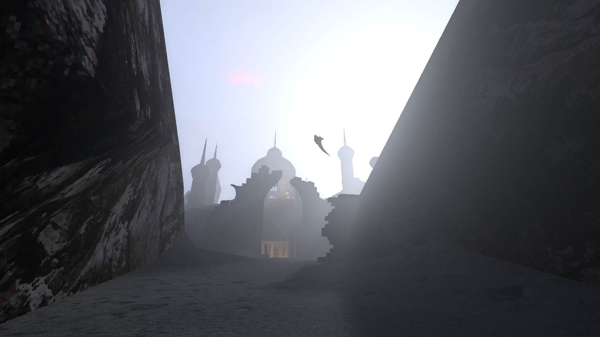
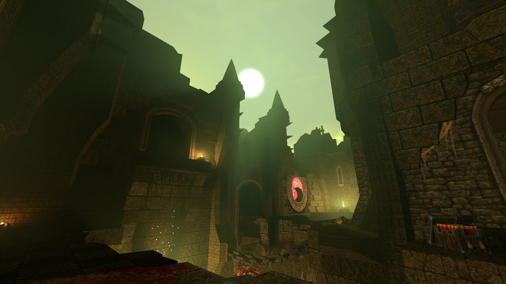
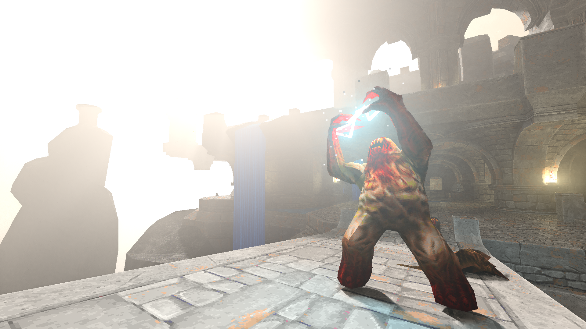

# Merian-Quake

A path-tracer for the original Quake game on top of  [quakespasm](https://github.com/sezero/quakespasm).

<hr>

This project introduces a novel real-time path guiding algorithm developed during my Master's thesis. For a comprehensive description of the algorithm and the inner workings of this project, please refer to the thesis.

> Lucas Alber. (2024), Markov Chain Path Guiding for Real-Time Global Illumination and Single-Scattering, MSc Thesis, Karlsruhe Institute of Technology.

<hr>

<p align="middle">
  
   
   
   
</p>

Maps in Screenshots: start from [Alkaline](https://alkalinequake.wordpress.com/) and ad_azad, ad_sepulcher, ad_tears from [Arcane Dimensions](https://www.moddb.com/mods/arcane-dimensions). 

## Requirements

This project requires a GPU with ray tracing support (Vulkan Ray Query).

Tested: NVIDIA RTX 2080 TI,  NVIDIA RTX 3070 TI, NVIDIA RTX 3080 TI, AMD RX 6800 XT.

## Usage

```bash
merian-quake <quakespasm arguments>
```

You can specify the path to your quake folder using the `-basedir` argument if you do not want to use the default.


## Building

Supported OS:

- Windows 11
- Linux

Build dependencies:

- Vulkan SDK
- Meson
- A fairly recent C++ compiler

```bash
# Clone the repository with all submodules:
git clone --recursive https://github.com/LDAP/merian-quake-rt
cd merian-quake-rt

# Compile
meson setup build [--prefix=path/to/installdir]
# or debug
meson setup build [--prefix=path/to/installdir] --buildtype=debug 

meson compile -C build

# Install
meson install -C build
```


## Development

```bash
# Unix
# Just run
./build/merian-quake [-basedir /path/to/quakedir]

# Windows: (requires .dll paths set up correctly)
meson devenv -C build
./build/merian-quake [-basedir /path/to/quakedir]
```


## Scripts: Helpers and Experiments

The `pyproject.toml` defines the dependencies required to run the experiments and helper scripts.
